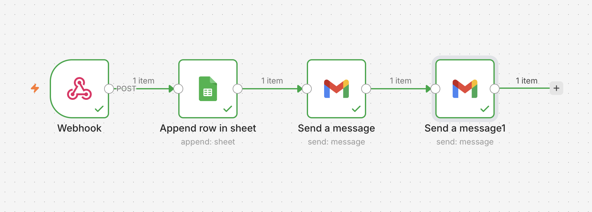
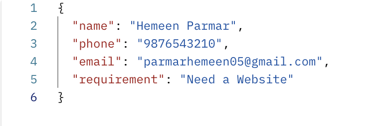
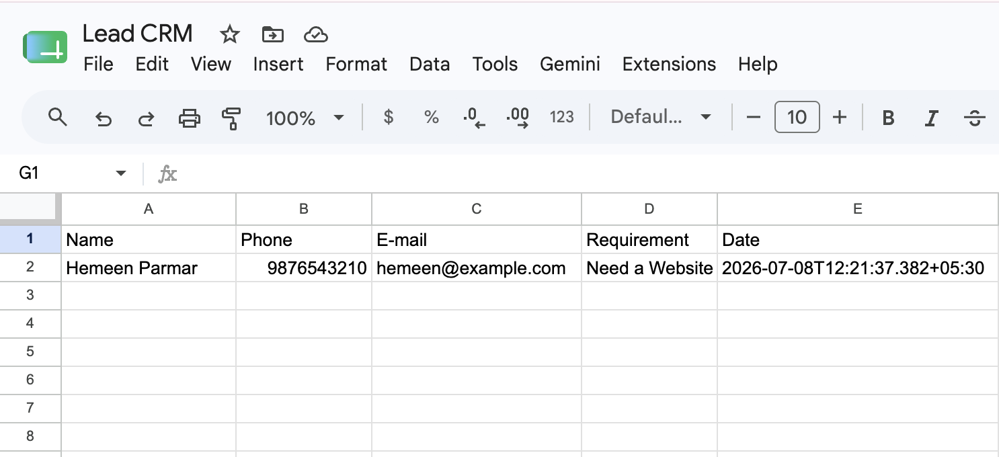
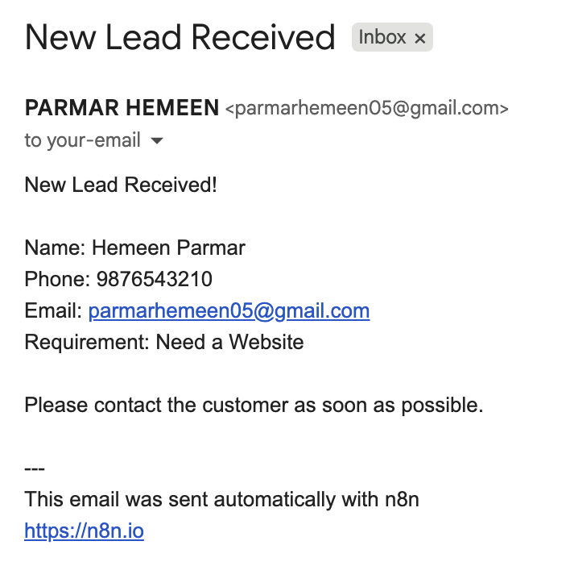
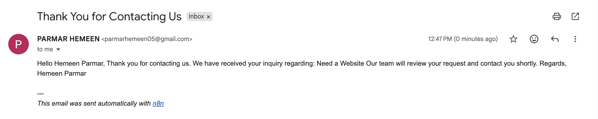

# 🚀 Lead Capture Automation using n8n

An automated Lead Management workflow built with **n8n**, **Google Sheets**, and **Gmail**. This workflow captures customer inquiries through a webhook, stores the lead information in Google Sheets, notifies the business owner, and sends an automatic confirmation email to the customer.

---

## 📌 Project Overview

This project demonstrates how workflow automation can eliminate manual lead management tasks.

Whenever a customer submits their information, the workflow automatically:

- Receives the lead through a Webhook
- Stores the lead in Google Sheets
- Sends an email notification to the business owner
- Sends a confirmation email to the customer

This project was developed using **n8n Cloud** and Google services.

---

## 🎯 Objectives

- Automate lead collection
- Store lead data securely
- Notify the business owner instantly
- Send automatic confirmation emails
- Demonstrate real-world workflow automation

---

# 🛠️ Technologies Used

- n8n Cloud
- Google Sheets API
- Gmail API
- Postman
- Google Sheets
- VS Code
- Git & GitHub

---

# 🔄 Workflow Architecture

```
Webhook
    │
    ▼
Google Sheets (Append Row)
    │
    ▼
Gmail (Owner Notification)
    │
    ▼
Gmail (Customer Confirmation)
```

---

# 📋 Workflow Description

## 1️⃣ Webhook Trigger

Receives an HTTP **POST** request containing customer details.

**Input Fields**

- Name
- Phone
- Email
- Requirement

---

## 2️⃣ Google Sheets

Automatically appends every new lead to the **Lead CRM** spreadsheet.

Stored fields:

- Name
- Phone
- Email
- Requirement
- Date & Time

---

## 3️⃣ Business Owner Notification

Automatically sends an email to the business owner containing:

- Customer Name
- Phone Number
- Email Address
- Requirement

---

## 4️⃣ Customer Confirmation Email

Automatically sends a confirmation email to the customer informing them that their inquiry has been received successfully.

---

# 📥 Sample Webhook Request

```json
{
  "name": "Hemeen Parmar",
  "phone": "9876543210",
  "email": "parmarhemeen05@gmail.com",
  "requirement": "Need a Website"
}
```

---

# 📤 Sample Outputs

## Google Sheets Entry

| Name | Phone | Email | Requirement | Date |
|------|-------|-------|-------------|------|
| Hemeen Parmar | 9876543210 | parmarhemeen05@gmail.com | Need a Website | Auto Generated |

---

## Business Owner Email

**Subject**

```
New Lead Received
```

**Body**

```
New Lead Received!

Name: Hemeen Parmar
Phone: 9876543210
Email: parmarhemeen05@gmail.com
Requirement: Need a Website

Please contact the customer as soon as possible.
```

---

## Customer Confirmation Email

**Subject**

```
Thank You for Contacting Us
```

**Body**

```
Hello Hemeen Parmar,

Thank you for contacting us.

We have received your inquiry regarding:

Need a Website

Our team will review your request and contact you shortly.

Regards,
Hemeen Parmar
```

---

# 📸 Project Screenshots

## Workflow



---

## Sample Input (Postman)



---

## Google Sheets Output



---

## Business Owner Email



---

## Customer Confirmation Email



---

# 📁 Project Structure

```
LEAD-CAPTURE-AUTOMATION/
│
├── LICENSE
├── README.md
├── workflow.json
│
└── screenshots/
    ├── workflow.png
    ├── form.png
    ├── sheets.png
    ├── new-lead.png
    └── customer-email.png
```

---

# ▶️ How to Run

1. Clone this repository.

```bash
git clone https://github.com/parmarhemeen05/LEAD-CAPTURE-AUTOMATION.git
```

2. Import **workflow.json** into n8n.

3. Configure:

- Google Sheets OAuth2
- Gmail OAuth2

4. Activate the workflow.

5. Copy the Production Webhook URL.

6. Send a POST request using Postman.

7. Verify:

- ✅ Lead stored in Google Sheets
- ✅ Owner receives notification email
- ✅ Customer receives confirmation email

---

# ✨ Features

- Automated Lead Capture
- Google Sheets Integration
- Gmail Notifications
- Customer Auto Reply
- Webhook Trigger
- Cloud-based Automation
- No Manual Data Entry

---

# 🚀 Future Improvements

- WhatsApp Notifications
- CRM Integration
- Duplicate Lead Detection
- Dashboard & Analytics
- File Upload Support
- Slack Notifications
- SMS Alerts

---

# 👨‍💻 Author

**Hemeen Parmar**

Computer Science & Engineering Student

GitHub: https://github.com/parmarhemeen05

Email: parmarhemeen05@gmail.com

---

# 📄 License

This project is licensed under the **MIT License**.

See the **LICENSE** file for more information.

---

⭐ If you found this project useful, consider giving it a star on GitHub!
